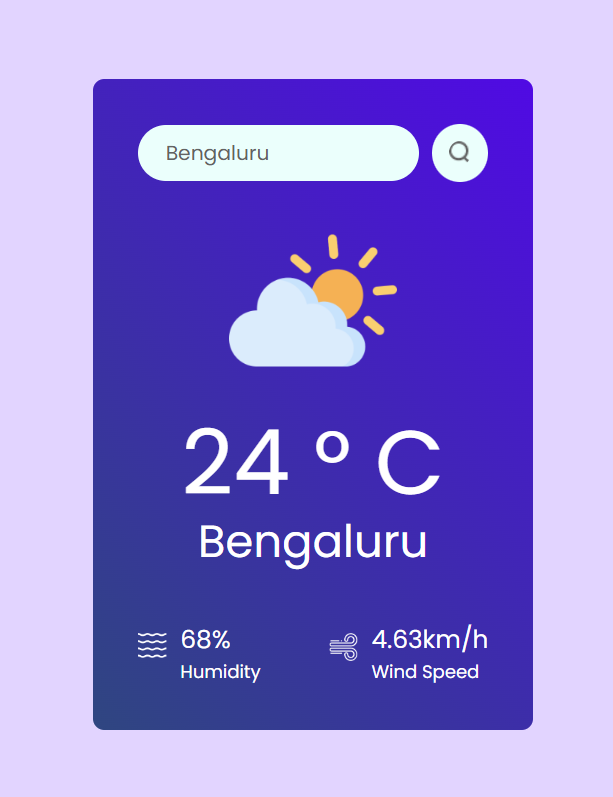

# Weather App

This project was created using Vite.

This template provides a minimal setup to get React working in Vite with HMR and some ESLint rules.

Currently, two official plugins are available:

- [@vitejs/plugin-react](https://github.com/vitejs/vite-plugin-react/blob/main/packages/plugin-react/README.md) uses [Babel](https://babeljs.io/) for Fast Refresh
- [@vitejs/plugin-react-swc](https://github.com/vitejs/vite-plugin-react-swc) uses [SWC](https://swc.rs/) for Fast Refresh

## API

This project uses the OpenWeatherMap API to fetch weather data. You can find more information about the API [here](https://openweathermap.org/api).

## Available Scripts

In the project directory, you can run:

### `npm install`

Installs the necessary packages from `package.json`.

### `npm run dev`

Runs the app in development mode.\
The page will reload when you make changes.\
You may also see any lint errors in the console.
